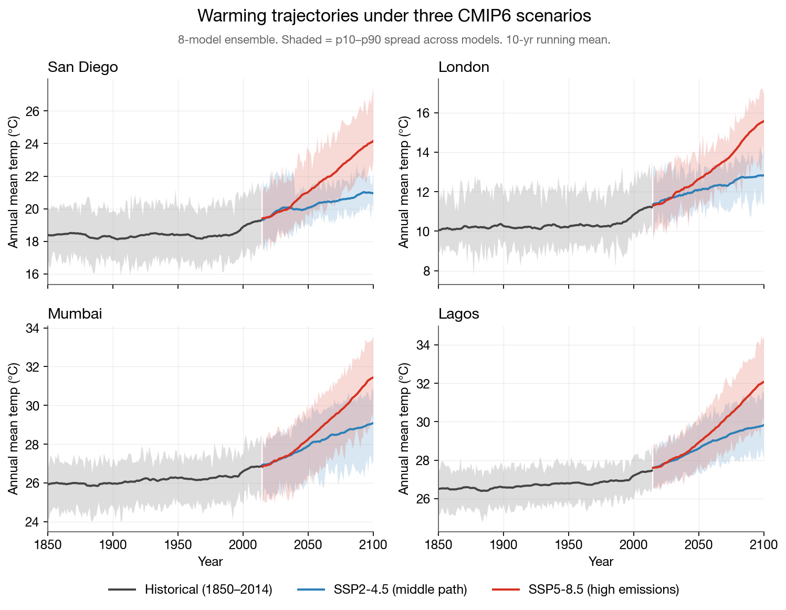
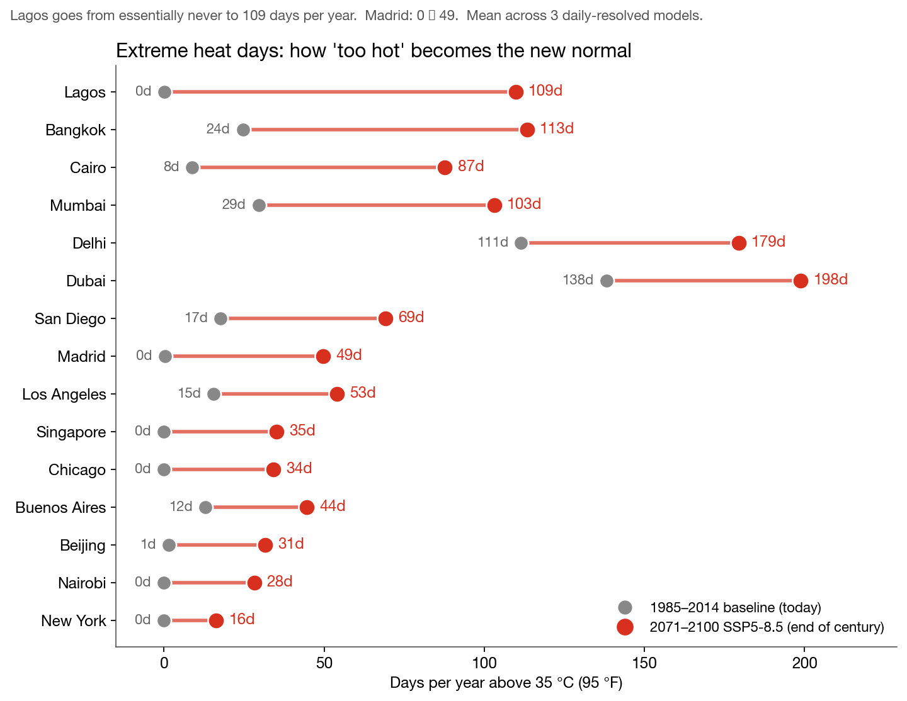
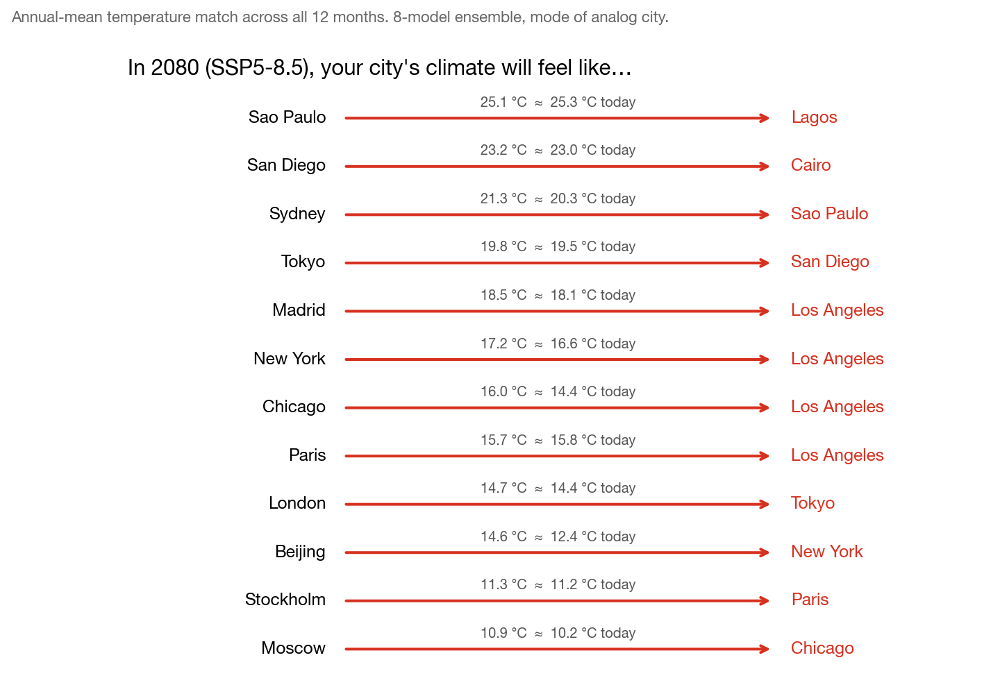
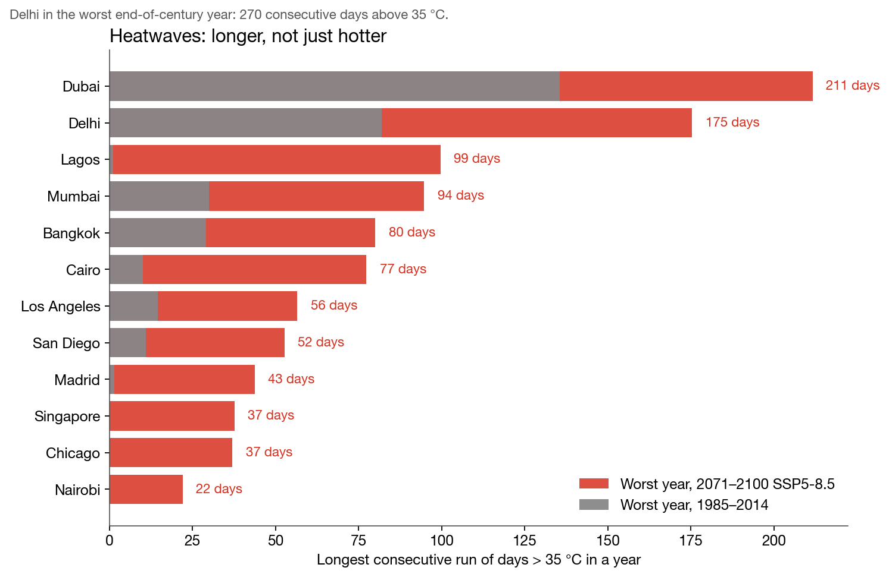
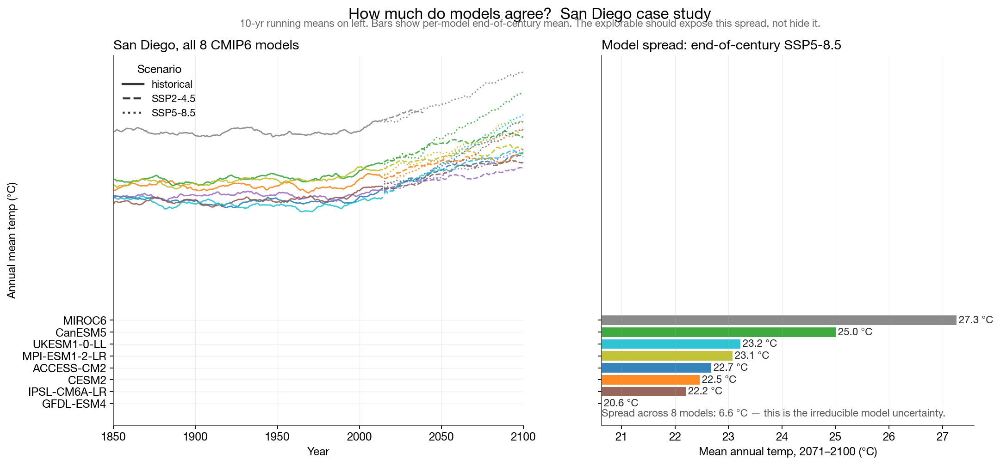
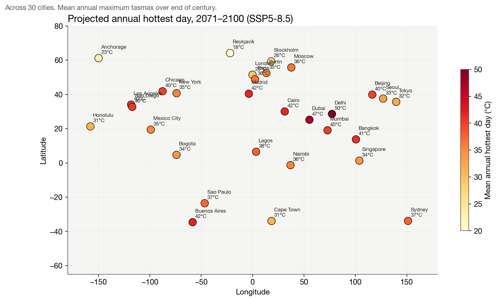

# Your City in 2080
### DSC 106 Final Project Proposal

**Team:** Yohan Kwon, Holden (UCSD), + 1 TBD
**Date:** May 19, 2026

---

## Project Title

**Your City in 2080 — A personal explorable explanation of climate change**

## Dataset

**CMIP6 (Coupled Model Intercomparison Project, Phase 6)** — the multi-institutional climate model archive used by the IPCC. We pulled data directly from the [Google Cloud public mirror](https://console.cloud.google.com/marketplace/product/noaa-public/cmip6) (`gs://cmip6`) via the Pangeo `intake-esm` / Zarr pipeline.

After processing 6+ hours of raw downloads, we have the following on hand:

| File | Rows | Description |
|---|---|---|
| `cmip6_cities_monthly.csv` | 2.04 M | Monthly mean temperature (`tas`) and precipitation (`pr`) for **30 cities × 8 models × 3 scenarios × 1850–2100** |
| `cmip6_cities_daily_extremes.csv` | 17.6 K | Annual extreme-heat metrics derived from daily `tasmax` for 30 cities × 3 models × 2 scenarios |
| `cmip6_climate_analog.csv` | 1.4 K | "Your city in 2080 = this city today" mapping for 30 cities × 3 decades × 2 scenarios |

All comfortably exceed the 100 rows × 5 columns minimum. The 30 cities span every inhabited continent (San Diego, New York, London, Tokyo, Mumbai, Lagos, São Paulo, Sydney, Anchorage, Reykjavík, etc.). 8 CMIP6 models are included to expose ensemble uncertainty: CESM2, GFDL-ESM4, MPI-ESM1-2-LR, UKESM1-0-LL, CanESM5, IPSL-CM6A-LR, ACCESS-CM2, MIROC6. Three emissions scenarios: historical, SSP2-4.5 (middle path), SSP5-8.5 (high emissions).

## What we intend to do

The classic problem with climate communication is that a "+2.8 °C by 2100" headline sounds small. The dramatic numbers live one layer deeper — in extreme-heat-day counts, heatwave durations, and analogies to cities people already know. Our explorable will surface those.

The reader picks their city (from 30 pre-loaded, with a "surprise me" random button) and watches three things change in real time:

1. **A warming trajectory chart** with historical + SSP2-4.5 + SSP5-8.5 lines and an 8-model uncertainty band.
2. **An extreme-heat panel** showing days-per-year above 35 °C *today* vs *2080*, with the big numbers animated. Lagos: 0 → 109 days. Madrid: 0 → 49 days. Heatwave duration: Delhi reaches 270 consecutive days above 35 °C in the worst case.
3. **A climate-analog reveal**: "Your city in 2080 will feel like ___ today." San Diego → Cairo. New York → Los Angeles. Paris → Los Angeles. Several cities have **no historical analog** — they're entering temperature regimes no city has ever lived in. That's the gut punch.

The reader can toggle between SSP2-4.5 and SSP5-8.5 to see how their city's future depends on choices made today. Built in D3.js, deployed on GitHub Pages.

## Static visualizations

### Figure 1 — Warming trajectories under three CMIP6 scenarios

Four cities, 1850–2100. Shaded bands show the p10–p90 spread across the 8-model ensemble; lines are the 10-year running mean of the ensemble mean. SSP5-8.5 (red) is the high-emissions future; SSP2-4.5 (blue) is the middle path. The fork between scenarios after 2050 is the visual hook for the explorable: *we are still choosing which line we live on.*

### Figure 2 — Extreme heat days: today vs end of century

Days per year above 35 °C (95 °F), 1985–2014 baseline vs 2071–2100 SSP5-8.5. The dumbbell encoding makes the *change* the visual subject, not the magnitudes. Lagos and Madrid going from essentially zero to many tens of dangerously hot days is more striking than a multi-degree shift in mean temperature. This will be the centerpiece "big-number" panel of the explorable.

### Figure 3 — Climate analogs: "Your city will feel like…"

For each city, we computed the historical 30-year monthly climatology and found, for every other city, the one whose modern climatology best matches our subject's projected 2070–2099 climatology (lowest RMSE across all 12 months). The result is a sentence anyone can grasp without a thermometer: *Paris becomes Los Angeles. Moscow becomes Chicago. Stockholm becomes Paris.* Mode across 8 models for stability.

### Figure 4 — Heatwaves get longer, not just hotter

Longest consecutive run of days above 35 °C in the worst year of each 30-year window. The end-of-century projections — Delhi 270 days, Dubai 245 days, Lagos 204 days — are not edge cases buried in a paper; they're the kind of number that lives in someone's head for a week.

### Figure 5 — Model agreement: how much do projections actually agree?

For one city (San Diego) shown across all 8 CMIP6 models. The left panel shows raw trajectories with scenario as line style. The right panel shows end-of-century mean per model under SSP5-8.5: a 6.6 °C spread between the coolest model (GFDL-ESM4, 20.6 °C) and the warmest (MIROC6, 27.3 °C). The explorable should *expose* this uncertainty, not hide behind an ensemble mean.

### Figure 6 — Projected annual hottest day, 2071–2100 (SSP5-8.5)

Each of the 30 cities, colored by the mean annual maximum daily temperature at end of century. The geographic distribution of risk is itself a story: it isn't only the tropics that hit dangerous thresholds — Madrid, Buenos Aires, Beijing, and several US cities cross 40 °C as a routine annual peak.

---

## Why this dataset will make for an interesting final project

CMIP6 is the same data the IPCC reports rest on, but it's almost never put in front of a general reader without being filtered through a paragraph of policy language. The dataset is high-resolution, multi-model, multi-scenario, and globally complete — meaning every reader has a personal entry point (their own city), and we can build interactions that *force* the user to confront concrete numbers instead of abstract °C anomalies. The model-disagreement angle is also fertile ground for a visualization-design conversation: the explorable can show *both* the ensemble headline number *and* the spread, which is exactly the kind of honest uncertainty communication most pop-sci articles skip.

## Acknowledgments

Built on the Pangeo cloud-native CMIP6 archive (`gs://cmip6`). Climate analog framing inspired by Fitzpatrick & Dunn (2019), *Contemporary climatic analogs for 540 North American urban areas in the late 21st century*, Nature Communications.
